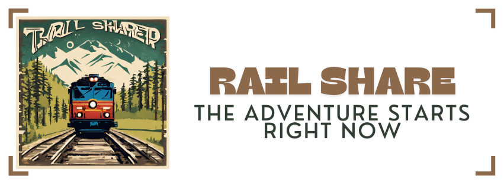
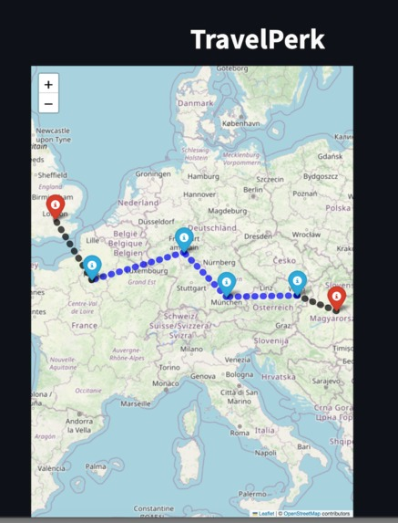
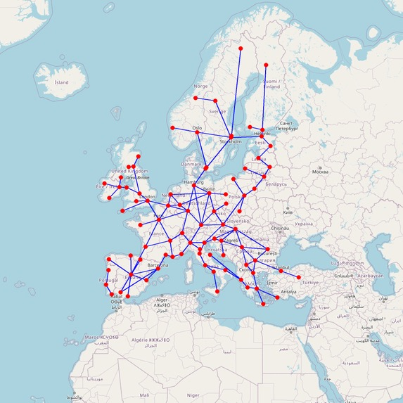

# RailShare (HackUPC2024 - TravelPerk Challenge)

RailShare is a go-to platform for planning train trips while prioritizing sustainability and social connections. Inspired by a interrail journey that we took some months ago, where we enjoyed meeting fellow travelers, RailShare aims to recreate this experience for other passengers.

Our solution takes your train trip details and generates routes from start to finish. But to get this objective, it uses smart algorithms that identifie other users traveling along similar routes. By matching travelers with shared interests, RailsShare helps form travel groups, making your journey not only eco-friendly but also socially rewarding.

And it's not just about getting from A to B. RailShare suggests events and activities at various stops along your route, giving you the chance to explore new places and bond with your travel companions.

# European trains graph
In order to find the routes, we used data from the European Interrail to build a graph.

# Dependencies
In order to run this project properly, the following dependencies must be installed:
  - folium
  - streamlit
  - networkx
  - Json
  - Requests
  - Random
  - matplotlib

These are the less comon needed libraries. However, it is possible that more libraries need to be installed

#Demo
In order to run a demo, execute in your terminal the command:
streamlit run app.py

# Authors
This project was made by the Business of Flowers:
- Anna Esteve
- Arnau Martínez
- Cristina Teixidó
- Laia Mogas

